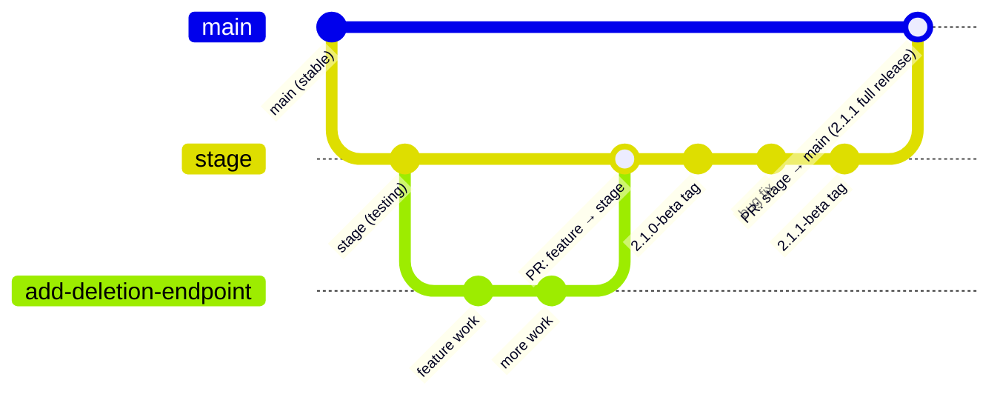
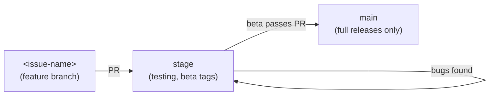
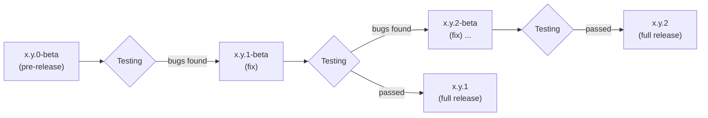

# Contributing Guide

This document explains how to contribute to Rustsystem: the branch structure, development workflow, and how releases are versioned and documented.

---

## Branch Structure

Development flows through two long-lived branches (`stage` and `main`) and short-lived feature branches:



| Branch         | Purpose                                                                                          |
| -------------- | ------------------------------------------------------------------------------------------------ |
| `main`         | Stable, production-ready code. Only updated when a beta is promoted to a full release.           |
| `stage`        | Integration and testing branch. Receives feature PRs; beta tags are created here.                |
| `<issue-name>` | Short-lived branch named after the issue being worked on. Branched from and merged into `stage`. |

### Workflow

1. **Create a branch off `stage`** named after the issue or feature (e.g. `add-deletion-endpoint`, `fix-sse-reconnect`).
2. **Develop and commit** on your feature branch.
3. **Open a PR from `<issue-name>` → `stage`** when the work is ready for testing.
4. **Test on `stage`**. Beta tags (`x.y.z-beta`) are created here. Fix bugs on `stage` directly or via follow-up PRs.
5. **Open a PR from `stage` → `main`** once a beta passes testing. `main` only ever receives full releases — beta tags remain on `stage`.



---

## Versioning

Versions follow **MAJOR.MINOR.PATCH**, optionally suffixed with `-beta` for pre-releases.

MAJOR and MINOR versions are **milestone-based**: each number corresponds to a defined project milestone. PATCH versions are used for incremental development updates made while working towards the next milestone.

| Component | When to increment                                                                                                                                                                                                                              |
| --------- | ---------------------------------------------------------------------------------------------------------------------------------------------------------------------------------------------------------------------------------------------- |
| **MAJOR** | Reaching a top-level milestone that represents a new generation of the project — e.g. a complete rewrite, a fundamental protocol change, or a shift in overall project direction so significant that it warrants a new major milestone series. |
| **MINOR** | Reaching a planned minor milestone — a defined set of features, goals, or deliverables that has been completed. What constitutes a milestone should be agreed upon before development begins (tracked on github milestones).                   |
| **PATCH** | Development updates made while working towards the next milestone — bug fixes, partial feature progress, documentation changes, small visual tweaks, or any change that does not yet complete a milestone.                                     |

### Beta Pre-releases

Every release that increments **MAJOR or MINOR must first be released as a `-beta` pre-release** and pass testing before it is promoted to a full release.

The promotion process works as follows:



**The full release tag is placed at the same commit as the accepted pre-release on `stage`, and that commit is then merged into `main` via PR.** No code changes are made between the last `-beta` tag and the full release tag. Beta tags only ever exist on `stage` — `main` only receives full releases.

> **Example:** `10.11.0-beta` is released on `stage`. Bugs are found and fixed in `10.11.1-beta`, `10.11.2-beta`, `10.11.3-beta`. Once `10.11.3-beta` passes testing, it is tagged `10.11.3` on `stage` and merged into `main`.

PATCH releases do not require a `-beta` pre-release and may be released directly as a full version.

---

## Release Notes

All release notes **must** follow this structure.

### 1. Title

```
# Release Notes — v<version>
```

### 2. Preamble

A short block (blockquote) immediately below the title containing:

- **Date** of release.
- **Built upon** — which version this release is built on top of.
- **Status** — either `pre-release` (with a note on what remains before promotion) or `stable`.

Example:

```markdown
> Release date: 2026-04-01
> Built on top of v2.0.3-beta.
> **Status: stable.**
```

```markdown
> Pre-release date: 2026-04-01
> Built on top of v2.0.0-beta.
> **Status: pre-release — requires stress testing before production use.**
```

---

### 3. Overview

A prose summary of the release followed by a **bullet point list** of every problem addressed or change made. The summary should communicate:

- How large the release is (patch-level tweak, significant feature addition, major overhaul, etc.).
- The motivation — what prompted the changes.

The bullet list gives a reader a complete picture at a glance before they read the detail sections.

Example:

```markdown
## Overview

v2.1.0-beta is a significant feature release ...

- New meeting deletion endpoint
- Vote state endpoints added
- Lock ordering corrected in README
```

---

### 4. Changes

One subsection per item from the overview bullet list. Each subsection:

- Explains the change in depth — what was changed, why, and what impact it has.
- Uses **tables** to compare before/after states, list endpoints, or summarise options where that aids clarity.
- Uses **Mermaid diagrams** to illustrate flows, architecture, or sequences where a diagram communicates more than prose.
- Is separated from the next section by a horizontal rule (`---`).

Example structure:

```markdown
## Changes

### New Meeting Deletion Endpoint

...explanation...

---

### Vote State Endpoints

...explanation, possibly with a table of endpoints...

---

### README: Lock Ordering Correction

...explanation...
```

#### When to use tables

Use a table when comparing multiple items across consistent attributes — e.g. a list of endpoints and their roles, a before/after comparison, or a summary of test coverage areas.

#### When to use Mermaid diagrams

Use a Mermaid diagram when the relationship between steps, services, or states is easier to understand visually than as prose. Preferred diagram types:

| Situation                        | Diagram type      |
| -------------------------------- | ----------------- |
| Multi-step flows or processes    | `flowchart`       |
| Service-to-service communication | `sequenceDiagram` |
| State machines                   | `stateDiagram-v2` |
| Version/branching timelines      | `gitGraph`        |

---

## Checklist Before Publishing a Release

- [ ] Version number follows MAJOR.MINOR.PATCH rules above (MAJOR/MINOR = milestone reached, PATCH = development update).
- [ ] If MINOR or MAJOR changed, this is a `-beta` pre-release.
- [ ] The PR from `stage` → `main` has been reviewed and testing passed.
- [ ] Preamble includes date, base version, and status.
- [ ] Overview contains a prose summary and a bullet list of all changes.
- [ ] Each bullet point has a corresponding Changes subsection.
- [ ] Tables or Mermaid diagrams are used where they add clarity.
- [ ] Each Changes subsection is separated by a horizontal rule.
