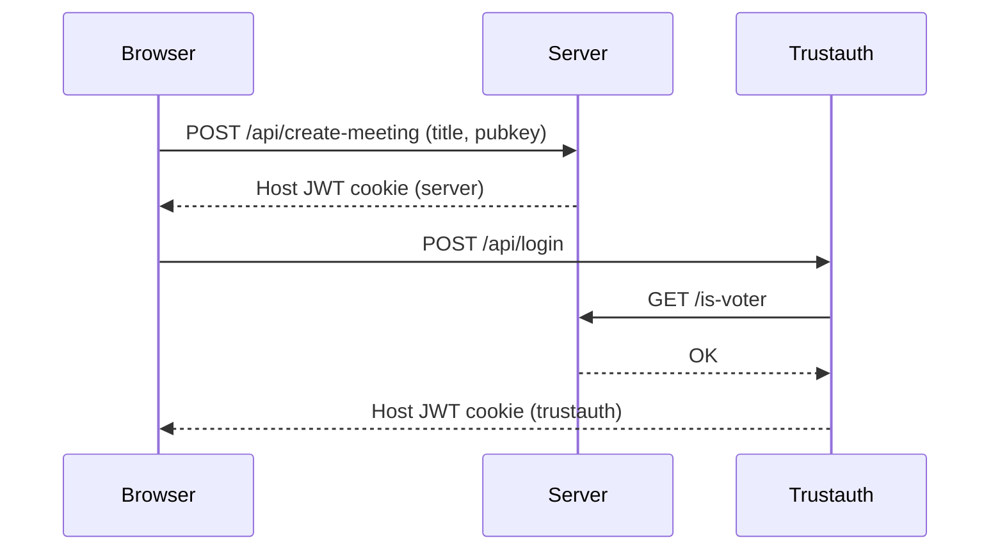
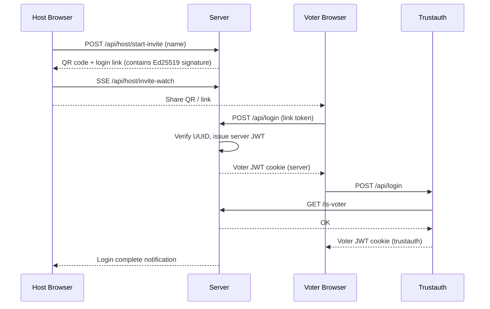
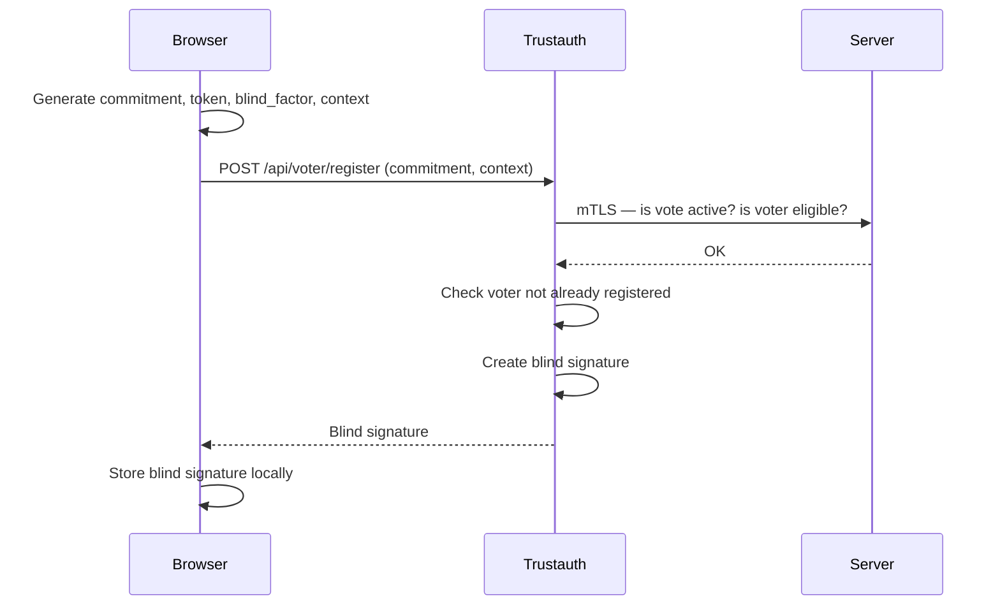
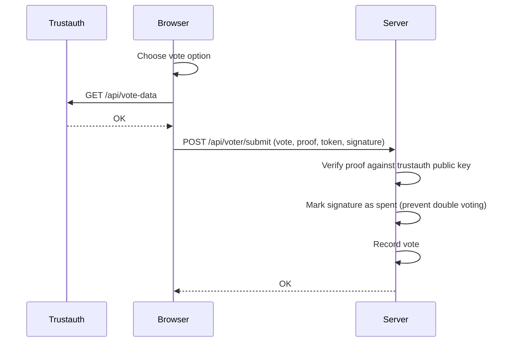

# Rustsystem

**Anonymous, cryptographically verifiable voting for FSEK meetings.**

Rustsystem is a modern, zero-trust voting system built for [F-sektionen](https://fsektionen.se) at Lund University. Using **BBS blind signatures** over the BLS12-381 curve, the system guarantees that every eligible voter can vote exactly once — without the server ever learning who voted for what. Integrity and anonymity are enforced mathematically, not by policy.

[](https://www.rust-lang.org/)
[](https://react.dev/)
[](https://datatracker.ietf.org/doc/html/draft-irtf-cfrg-bbs-blind-signatures-02)
[](https://hackmd.io/@benjaminion/bls12-381)
[](https://cr.yp.to/ecdh.html)
[](https://en.wikipedia.org/wiki/Mutual_authentication)

---

## Table of Contents

- [Quick-Start Guide](#quick-start-guide)
  - [Creating a Meeting](#creating-a-meeting)
  - [Inviting Voters](#inviting-voters)
  - [Starting a Vote Round](#starting-a-vote-round)
  - [Voting](#voting)
  - [Tally](#tally)
  - [Downloading the Tally](#downloading-the-tally)
  - [Ending a Vote Round](#ending-a-vote-round)
  - [Closing the Meeting](#closing-the-meeting)
- [Architecture](#architecture)
  - [Overall Structure](#overall-structure)
  - [Logging In](#logging-in)
  - [Voting](#voting-architecture)
  - [Tally](#tally-architecture)
  - [RwLocks](#rwlocks)
- [Cryptography](#cryptography)
  - [BBS Blind Signatures (BLS12-381)](#bbs-blind-signatures-bls12-381)
  - [X25519 Tally Encryption](#x25519-tally-encryption)
- [Running Rustsystem](#running-rustsystem)
  - [Development](#development)
  - [Deployment](#deployment)

---

## Quick-Start Guide

This section explains how to run a meeting without going into implementation details. For the underlying mechanics, see [Architecture](#architecture).

### Creating a Meeting

Navigate to the Rustsystem home page and click **Create Meeting**. You will be asked to provide:

- A **meeting title**.
- Your **name**
- A **password**.

The password is important: each tally is saved on the server in a file that is encrypted with a public key derived from this password. This means **only someone with the password can decrypt the tally file**. This is a last-resort safeguard, if the meeting hosts forget to download the tally before closing the vote round, the file can still be recovered offline using the password. Under normal operation the host downloads the tally during the meeting and never needs the file at all.

After creation you will be logged in as the host and taken to the host dashboard.

### Inviting Voters

From the host dashboard, use the **Add Voter** panel to create an invitation for each participant. Give the voter a name and click **Add**. The system creates a voter account immediately, but the voter is not yet logged in.

Each invitation generates a **QR code and a unique link**. Share either with the voter. When the voter scans the QR code or follows the link, their browser completes the login sequence automatically and they appear as active on the host dashboard.

> **Note:** Voters who have been created but have never followed their login link are considered _unclaimed_. When a new vote round starts, all unclaimed voters are automatically removed so that no one can log in mid-vote.

### Starting a Vote Round

When all voters are present, the host configures the vote round:

- **Motion / question** to vote on.
- **Candidates or options** (yes/no, list of names, etc.).
- **How many options** can be chosen.
- Whether to **shuffle the candidate order** option order.

> **Note:** A _blank_ option is always provided. Do not include this in your vote options.

Press **Start vote round**. The meeting is now locked — no new voters can join until the round ends.

> **Note:** Voters could still be removed during voting, although this is highly discouraged for security reasons. A voter could have already acquired a valid signature at this point which would make them eligible to vote.

### Voting

#### Registration

Before a voter can cast a ballot, they must register for the current round. The voter presses **Register to vote** in their browser. This sends a cryptographic commitment to the signing authority; the authority creates a blind signature which is used later. See [Voting Architecture](#voting-architecture) for why this step is necessary.

#### Choosing

The voter sees the ballot with all available options and selects their choice(s).

#### Submitting

The voter presses **Submit**. Their browser retrieves their credentials and sends the vote together with a cryptographic proof derived from the blind signature. The server verifies the proof and records the vote. The blind signature is then marked as spent — it cannot be used again.

The host dashboard shows vote progress in real time.

### Tally

Once the host is satisfied that everyone has voted, they press **Tally votes**. The server finalizes the count, returns the results, and saves an encrypted copy of the tally on the server.

The results are shown on screen broken down by candidate with a separate count for blank votes. The tally is only visible on the admin page.

### Downloading the Tally

The host should **download the tally** before ending the vote round. The download button on the tally panel saves the tally in the desired format with the full results. This is the primary way to keep a record.

The encrypted backup on the server can be decrypted later using the meeting password if needed. See [Tally Architecture](#tally-architecture) for the decryption procedure.

### Ending a Vote Round

After recording the results, the host presses **End Round**. This resets the voting state so that a new round can be started. The meeting is unlocked and voters may be added again.

### Closing the Meeting

When the meeting is finished, the host presses **Close meeting**. All in-memory state for the meeting is discarded. Encrypted tally files that were saved to disk remain on the server.

---

## Architecture

This section describes the technical structure of Rustsystem. For cryptographic details, see [Cryptography](#cryptography).

### Overall Structure

Rustsystem is split into two backend services and one frontend:

| Component                | Role                                                                                               |
| ------------------------ | -------------------------------------------------------------------------------------------------- |
| **rustsystem-server**    | Manages meetings, voters, vote rounds, and tallies. Serves the frontend SPA.                       |
| **rustsystem-trustauth** | Acts as the blind-signing authority. Registers voters for vote rounds and issues blind signatures. |
| **Frontend**             | React SPA served by the server. Performs all client-side cryptographic operations.                 |

The two backend services communicate with each other over a **mutual TLS (mTLS)** channel on internal ports (1444 and 2444). Neither service trusts the other without a valid certificate. The public-facing APIs use standard HTTPS, JWT and auth cookies.

```
┌──────────────────────────────────────────────────────────────────┐
│                           Browser                                │
│                     (React + @noble/curves)                      │
└──────────┬───────────────────────────────────────────┬───────────┘
           │ HTTPS :1443                   HTTPS :2443 │
           ▼                                           ▼
┌──────────────────────┐                    ┌──────────────────────┐
│  rustsystem-server   │                    │ rustsystem-trustauth │
│  (Axum, port 1443)   │◄──────────────────►│  (Axum, port 2443)   │
│  internal: 1444      │mTLS                │  internal: 2444      │
└──────────────────────┘                    └──────────────────────┘
       (in-memory)                                (in-memory)
```

All meeting state is **in-memory**, there is no database. The only data written to disk is encrypted tally files.

### Logging In

There are two login flows: one for meeting creation and one for voter invitation. In both cases the user ends up with **two JWT cookies** — one for the server and one for trustauth. Both are required because:

- The **server cookie** identifies the user for meeting management operations.
- The **trustauth cookie** identifies the user for blind-signature operations.
- Trustauth must verify that the user actually exists in the server's voter list before issuing any signatures.

#### Meeting Creation



#### Voter Invitation



The login link contains the meeting UUID and the new voter UUID. The server will check this against its record and accept the voter (which claims the UUID) if the UUID is valid and has not already been claimed.

### Voting Architecture

The voting flow is the core of Rustsystem's security model. The key insight is:

> **Trustauth knows _who_ is eligible but never learns _what_ they voted for. The server knows _what_ was voted but never learns _who_ voted. Neither can (even in principle) piece together the full picture.**

This is achieved through BBS blind signatures. See [Cryptography — BBS Blind Signatures](#bbs-blind-signatures-bls12-381) for how they work.

#### Registration



#### Submitting a Vote



Notice that the submission goes **directly to the server**, not through trustauth. The server only holds the trustauth **public key**. It can verify the proof without ever contacting trustauth or knowing which voter submitted it.

#### Integrity and Anonymity Guarantees

| Property               | How it is enforced                                                                                                   |
| ---------------------- | -------------------------------------------------------------------------------------------------------------------- |
| **One vote per voter** | Trustauth issues exactly one blind signature per voter per round. The server marks each signature as spent on use.   |
| **Anonymity**          | The server never sees the voter's identity during submission. The proof is unlinkable to the registration request.   |
| **Eligibility**        | Trustauth checks with the server that the voter is a member of the meeting and that voting is active before signing. |

### Tally Architecture

When the host calls **Get Tally**, the server finalizes the vote count and saves the result as an encrypted file.

#### Encryption

The tally is encrypted using the **X25519 public key** that the host provided at meeting creation time (derived from their password — see [X25519 Tally Encryption](#x25519-tally-encryption)). The private key **never reaches the server**. This means:

- The server cannot read the tally file itself.
- Anyone with access to the server filesystem cannot read past tallies without the meeting password.

The file is written to `meetings/{meeting-id}/tally-{timestamp}.enc` on the server.

#### Manual Decryption

If the tally was not downloaded during the meeting, it can be recovered:

1. Retrieve the `.enc` file from the server.
2. Derive the private key from the meeting password:
   ```bash
   SALT_HEX="<prod-salt>" KEYGEN_ITERATIONS=200000 ./scripts/derive-keys.sh <password>
   # Outputs: private_x25519.pem, public_x25519.pem
   ```
3. Decrypt using the `decrypt-tally` crate:
   ```bash
   cargo run --package decrypt-tally /path/to/tally-<timestamp>.enc /path/to/private_x25519.pem
   # Outputs JSON tally to stdout
   ```

The SALT_HEX and KEYGEN_ITERATIONS values for the production server must match the values used when the meeting was created. They should be available publicly in this repository.

### RwLocks

Rustsystem uses a two-level locking strategy throughout to allow maximum concurrency while preventing data races.

#### RwLock structure — rustsystem-server

##### Overview

All meeting state lives in `ActiveMeetings`:

```
Arc<AsyncRwLock<HashMap<MUuid, Arc<Meeting>>>>
```

The outer `AsyncRwLock` wraps the map of all meetings. Inside each entry is an `Arc<Meeting>` whose fields carry their own individual locks.

##### Outer map lock

The outer map is held in **write mode** only when the map itself changes:

| Operation       | Outer lock                                          |
| --------------- | --------------------------------------------------- |
| Create meeting  | Write                                               |
| Close meeting   | Write                                               |
| Everything else | Read (just long enough to clone the `Arc<Meeting>`) |

The `AppState::get_meeting()` helper encapsulates the common case: it acquires a read lock, clones the `Arc<Meeting>`, and releases the lock before returning. Callers then work with the `Arc` without holding the outer lock at all.

##### Per-field locks inside `Meeting`

```rust
pub struct Meeting {
    pub title: String,           // immutable after construction — no lock
    pub start_time: SystemTime,  // immutable after construction — no lock
    pub locked: AtomicBool,      // simple flag — atomic, no lock
    pub voters:     AsyncRwLock<HashMap<Uuid, Voter>>,
    pub vote_auth:  AsyncRwLock<VoteAuthority>,
    pub invite_auth: AsyncRwLock<InviteAuthority>,
    pub admin_auth:  AsyncRwLock<AdminAuthority>,
}
```

Each authority is locked independently. Operations that only need `vote_auth` do not block operations that only need `voters`, and vice versa.

##### Lock ordering

When an operation must acquire more than one field lock, it always does so in this order to prevent deadlock:

1. `voters`
2. `vote_auth`
3. `invite_auth`
4. `admin_auth`

Operations that currently acquire multiple locks:

| Endpoint      | Locks acquired (in order)                                                                         |
| ------------- | ------------------------------------------------------------------------------------------------- |
| `start-vote`  | `vote_auth.write` → `voters.write` (safe: nothing holds `voters.write` and waits for `vote_auth`) |
| `login`       | `voters.write` → `invite_auth.write` → `admin_auth.write`                                         |
| `new-voter`   | `voters.write` → `admin_auth.write`                                                               |
| `reset-login` | `voters.write` → `admin_auth.write`                                                               |

`start-vote` acquires `vote_auth.write` before `voters.write` to make the "check inactive, then start" sequence atomic. This does not violate the ordering because no other operation holds `voters.write` and then waits for `vote_auth.write`.

#### RwLock structure — rustsystem-trustauth

##### Overview

All round state lives in `ActiveRounds`:

```
Arc<AsyncRwLock<HashMap<Uuid, Arc<RoundState>>>>
```

Same two-level pattern as the server: the outer `AsyncRwLock` wraps the map of all rounds; inside each entry is an `Arc<RoundState>` whose mutable field carries its own lock.

##### Outer map lock

| Operation       | Outer lock                                             |
| --------------- | ------------------------------------------------------ |
| Start round     | Write                                                  |
| Everything else | Read (just long enough to clone the `Arc<RoundState>`) |

`AppState::get_round()` acquires a read lock, clones the `Arc<RoundState>`, and releases the lock before returning.

##### Per-field locks inside `RoundState`

```rust
pub struct RoundState {
    pub keys: AuthenticationKeys,  // immutable after construction — no lock
    pub header: Vec<u8>,           // immutable after construction — no lock
    pub registered_voters: AsyncRwLock<HashMap<Uuid, VoterRegistration>>,
}
```

`keys` and `header` are set once by `start-round` and never modified. Only `registered_voters` needs a lock.

| Endpoint        | `registered_voters` lock |
| --------------- | ------------------------ |
| `register`      | Write                    |
| `is-registered` | Read                     |
| `vote-data`     | Read                     |

---

## Cryptography

### BBS Blind Signatures (BLS12-381)

The core of Rustsystem's anonymity guarantee is **BBS blind signing** ([draft-irtf-cfrg-bbs-blind-signatures-02](https://datatracker.ietf.org/doc/html/draft-irtf-cfrg-bbs-blind-signatures-02)).

BBS signatures are pairing-based signatures defined over the BLS12-381 elliptic curve. The "blind" variant lets a client ask for a signature over a message that is hidden from the signer. The signer cannot see what they are signing, yet the resulting signature is fully verifiable by anyone with the public key.

In Rustsystem this works as follows:

1. The **voter's browser** generates a secret token and a Pedersen commitment (a hiding, binding commitment to the token). The commitment is sent to trustauth; the token stays in the browser.
2. **Trustauth** verifies eligibility and signs the commitment — without ever seeing the token.
3. The **browser** uses the blind factor and the blind signature to produce a standard BBS proof of knowledge that can be verified against trustauth's public key.
4. The **server** verifies the proof using only the public key. It cannot tell which voter produced the proof.

The ciphersuite used is `BbsBls12381Sha256` from the [`zkryptium`](https://crates.io/crates/zkryptium) crate (Rust backend) and [`@noble/curves`](https://github.com/paulmillr/noble-curves) (TypeScript frontend).

### X25519 Tally Encryption

Tally files are encrypted using **ECIES with X25519**:

1. The host's **password** is stretched into a 32-byte seed via PBKDF2-HMAC-SHA256 (using a server-side salt and configurable iterations).
2. The seed is interpreted directly as an **X25519 static private key**; the corresponding public key is stored in the meeting.
3. At tally time the server generates an **ephemeral X25519 keypair**, performs ECDH with the meeting's public key, derives an encryption key via **HKDF-SHA256**, and encrypts the tally JSON with **ChaCha20-Poly1305**.
4. The output file is: `ephemeral_pk (32 B) ‖ nonce (12 B) ‖ ciphertext+tag`.

Because the private key is derived entirely from the password and the salt (never transmitted), the server can encrypt but never decrypt. Libraries used: [`x25519-dalek`](https://crates.io/crates/x25519-dalek), [`chacha20poly1305`](https://crates.io/crates/chacha20poly1305), [`hkdf`](https://crates.io/crates/hkdf).

---

## Running Rustsystem

Rustsystem is the official voting system for F-sektionen at TLTH and is available at [rosta.fsektionen.se](https://rosta.fsektionen.se).

### Development

This section covers how to run all parts of the system locally for development. You will find instructions for setting up the server and trustauth backends as well as building and running the frontend dev server.
TODO!

### Deployment

#### Deploy for the F-guild

Contact the person responsible for Rustsystem for instructions on how to deploy on the F-guild server.

#### Deploy for yourself!

Anyone can set up Rustsystem on their own server. This section covers how to configure the environment, build the Docker images, and run Rustsystem on a server you control.
TODO!
