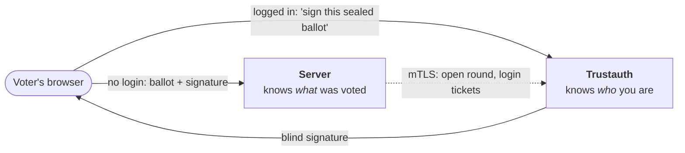
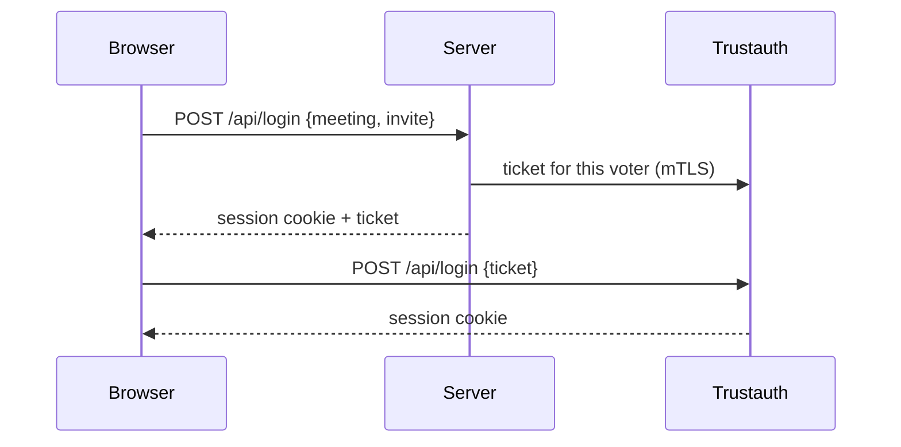
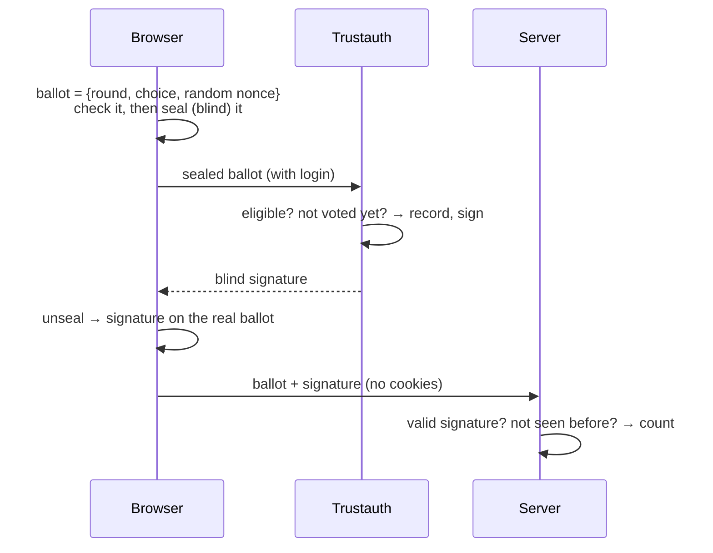

# Rustsystem

**Anonymous voting for FSEK meetings.**

Rustsystem runs the votes at [F-sektionen](https://fsektionen.se) meetings at Lund University. Every eligible voter can vote exactly once per round, and nobody — not the hosts, not the people running the servers — can tell who voted for what. That guarantee comes from **RSA blind signatures** ([RFC 9474](https://www.rfc-editor.org/rfc/rfc9474)), not from promises.

[](https://www.rust-lang.org/)
[](https://react.dev/)
[-blueviolet>)](https://www.rfc-editor.org/rfc/rfc9474)
[](https://cr.yp.to/ecdh.html)
[](https://en.wikipedia.org/wiki/Mutual_authentication)

---

## Contents

1. [What Rustsystem guarantees](#what-rustsystem-guarantees)
2. [Running a meeting](#running-a-meeting) — a guide for hosts and voters
3. [How it works](#how-it-works) — the two services, logging in, voting, results
4. [Project layout](#project-layout)
5. [Development](#development) — running locally, testing
6. [Configuration](#configuration)
7. [Deployment](#deployment)
8. [Design decisions](#design-decisions)

The full protocol — every message, rule and known limit — is specified in **[docs/PROTOCOL.md](docs/PROTOCOL.md)**. This README gives the overview and links there for detail.

---

## What Rustsystem guarantees

| Guarantee                                    | How                                                                                | Details                               |
| -------------------------------------------- | ---------------------------------------------------------------------------------- | ------------------------------------- |
| Only eligible voters vote, once per round    | Trustauth signs one ballot per voter per round; the server counts each ballot once | [How voting works](#how-voting-works) |
| Nobody can link a ballot to a voter          | Ballots are signed blind and arrive without any login                              | [Who knows what](#the-two-services)   |
| Refreshing or closing the page loses nothing | Logins are `HttpOnly` cookies; nothing secret is stored in the browser             | [Staying logged in](#logging-in)      |
| A lost ballot is noticed                     | The host sees _eligible / signed / received_ for every round                       | [Results](#results)                   |
| The server can't read stored results         | Results are encrypted to a key derived from the meeting password                   | [Results](#results)                   |

What it does **not** protect against is written down too: see [Known limits](docs/PROTOCOL.md#9-guarantees-and-known-limits).

---

## Running a meeting

This section is for hosts. Voters only ever need to scan a QR code and press one button.

### 1. Create the meeting

Go to the Rustsystem home page and choose **Create Meeting**. Enter a title, your name, and a **password**.

The password protects the results stored on the server: each round's results are saved in a file that only this password can decrypt. Your browser turns the password into a key pair and sends only the public half; the password itself never leaves your browser. Keep it — without it, the stored files can't be read ([details](#results)).

You're now the host and land on the **Admin** page.

### 2. Invite voters

In **Add voter**, type a name and press **Add**. A QR code and a link appear; give one of them to that person. When they open it they are logged in, and the dashboard says _"Anna has logged in."_ Tick **Grant host privileges** to invite a co-host.

- Each link works **once**. If someone needs to log in again on another device, remove them and invite them again.
- Voters who never opened their link are removed automatically when a round starts.
- Hosts can remove anyone except themselves.

### 3. Run a vote round

In **Vote round**, enter what's being voted on, the options, how many options each voter may pick, and whether to shuffle their order. A **Blank vote** button is always available, so don't add a blank option. Press **Start vote round**.

While a round is open the voter list is frozen: nobody can be added, removed or re-invited until it ends.

Voters see the options on their phones, choose, and press **Submit vote** (or **Blank vote**). That's all they do. They can refresh or close the page afterwards and it will still say they have voted. Hosts vote from the Admin page in the same way.

The dashboard shows **Votes cast** (ballots received, out of eligible voters) and **Ballots signed**.

### 4. Tally

Press **Tally votes**. The results appear on the dashboard, and an encrypted copy is saved on the server. Use the download button next to the results to save them as JSON, YAML, TOML, RON or binary JSON.

If more ballots were **signed** than **received**, a warning appears: someone closed their page in the split second between their ballot being signed and it reaching the server. Their vote was lost, and you may want to run the round again.

Press **End round** to clear the result and start the next round.

### 5. Close the meeting

**Close meeting** opens a confirmation panel. Before confirming, you can enter the meeting password and press **Download** to decrypt every round's results in your browser and save them as one `tallies.json`. Closing logs everyone out; the encrypted files stay on the server and can still be decrypted later with [`decrypt-tally`](#decrypting-results-offline).

> **Never restart or redeploy the servers during a meeting.** All meeting state lives in memory by design ([why](#design-decisions)), so a restart ends every meeting.

---

## How it works

### The two services


```mermaid
flowchart LR
    B([Voter's browser])
    T["<b>Trustauth</b><br/>knows <i>who</i> you are"]
    S["<b>Server</b><br/>knows <i>what</i> was voted"]
    B -- "logged in: 'sign this sealed ballot'" --> T
    T -- "blind signature" --> B
    B -- "no login: ballot + signature" --> S
    S -. "mTLS: open round, login tickets" .-> T
```

- **Trustauth** knows who you are. Once per round it signs one ballot for you — _blind_, so it never sees what you voted.
- **The server** runs the meeting and counts ballots. A ballot is valid if trustauth signed it; ballots arrive without any login, so the server can't tell whose they are.

Neither can link a ballot to a voter on its own. The table of exactly who knows what is in [PROTOCOL.md §2](docs/PROTOCOL.md#2-who-knows-what).

### Logging in

An invite link carries the meeting ID and a one-time secret. Opening it logs you in to the server, which hands your browser a short-lived ticket to log in to trustauth too:


```mermaid
sequenceDiagram
    participant B as Browser
    participant S as Server
    participant T as Trustauth
    B->>S: POST /api/login {meeting, invite}
    S->>T: ticket for this voter (mTLS)
    S-->>B: session cookie + ticket
    B->>T: POST /api/login {ticket}
    T-->>B: session cookie
```

Both sessions are `HttpOnly` cookies lasting 12 hours, so refreshing or reopening the browser keeps you logged in, and page scripts can't read them. Details: [PROTOCOL.md §4](docs/PROTOCOL.md#4-meeting-lifecycle).

### How voting works

Pressing **Submit vote** does everything in one go:


```mermaid
sequenceDiagram
    participant B as Browser
    participant T as Trustauth
    participant S as Server
    B->>B: ballot = {round, choice, random nonce}<br/>check it, then seal (blind) it
    B->>T: sealed ballot (with login)
    T->>T: eligible? not voted yet? → record, sign
    T-->>B: blind signature
    B->>B: unseal → signature on the real ballot
    B->>S: ballot + signature (no cookies)
    S->>S: valid signature? not seen before? → count
```

1. **Seal.** The browser writes the ballot and blinds it with a random factor. Sealed, it's indistinguishable from random noise.
2. **Sign.** Trustauth checks you're eligible and haven't voted this round, records that you now have, and signs the sealed ballot.
3. **Unseal.** Removing the factor leaves a normal signature on your real ballot. The browser checks it against the round key it got from the _server_, so trustauth can't use a special key to recognise you later.
4. **Submit.** The ballot goes to the server with no cookies. The server checks the signature and counts each distinct ballot once.

Nothing is stored in the browser at any point. After a refresh, the page asks trustauth whether you've voted this round. Every rule a ballot must pass is listed in [PROTOCOL.md §5–6](docs/PROTOCOL.md#5-voting-round).

### Results

When a round closes, the server encrypts the result for the meeting's **tally key** and writes it to `meetings/<meeting id>/tally-<time>-<round>.enc`. The tally key was derived from the meeting password in the host's browser:

```
password ──Argon2id(salt unique to the meeting)──▶ X25519 private key ──▶ public key (sent to the server)
```

The server only has the public key, so it can write these files but never read them. Each file records its salt and Argon2id settings, so the password alone decrypts it — in the browser at close, or offline with [`decrypt-tally`](#decrypting-results-offline). The file also records how many voters were eligible, signed and received. Format: [PROTOCOL.md §8](docs/PROTOCOL.md#8-tally-files).

---

## Project layout

| Path                                                      | What it is                                                                                                                                 |
| --------------------------------------------------------- | ------------------------------------------------------------------------------------------------------------------------------------------ |
| [`docs/PROTOCOL.md`](docs/PROTOCOL.md)                    | The protocol specification. Code follows this document.                                                                                    |
| [`rustsystem-core`](rustsystem-core/src/lib.rs)           | Shared by both services: the error type, the server ↔ trustauth API types, the blind-signature wrapper, request limits, sessions, mTLS.   |
| [`rustsystem-server`](rustsystem-server/src/lib.rs)       | The server. `state.rs` holds every meeting rule; `ballot.rs` every ballot rule; `lib.rs` has the full route table.                         |
| [`rustsystem-trustauth`](rustsystem-trustauth/src/lib.rs) | Trustauth. `state.rs` holds what it knows and the one-signature-per-voter rule.                                                            |
| [`decrypt-tally`](decrypt-tally/src/main.rs)              | CLI that decrypts a tally file with the meeting password.                                                                                  |
| [`frontend`](frontend)                                    | React 19 + TanStack Router. `src/api/` talks to the backends, `src/voting/ballot.ts` casts votes, `src/utils/` holds the tally-key crypto. |
| [`mtls`](mtls/mkcerts.sh)                                 | Generates the certificates the two services use to talk to each other.                                                                     |

Within the server, each meeting's state sits behind **one** lock, and every state change is a plain synchronous method on `MeetingState` that either fully succeeds or changes nothing. There is no lock ordering to get wrong. See the module docs in [`state.rs`](rustsystem-server/src/state.rs) and [`app.rs`](rustsystem-server/src/app.rs).

---

## Development

### Prerequisites

Rust (stable), Node 22+, pnpm, and OpenSSL for the certificates.

```bash
cd mtls && bash mkcerts.sh dev && cd ..     # once: certificates for server ↔ trustauth
cd frontend && pnpm install && pnpm build && cd ..
./run_dev.sh                                 # trustauth on :2443/:2444, server on :1443
```

Open <http://localhost:1443> (use `localhost`, not `127.0.0.1`: trustauth's cookie only works when both services share a host name). For frontend work with hot reload, also run `cd frontend && pnpm dev` and use <http://localhost:3000>.

[`run_dev.sh`](run_dev.sh) loads [`.env`](.env), which holds every development setting ([reference](#configuration)).

### Testing

| Suite                                                                  | Command                        | Needs                    |
| ---------------------------------------------------------------------- | ------------------------------ | ------------------------ |
| Backend: unit tests and end-to-end tests with both services in-process | `cargo test --workspace`       | nothing                  |
| Frontend: unit tests, including the cross-checks against the Rust code | `cd frontend && pnpm test`     | nothing                  |
| Browsers: whole meetings in Chromium, Firefox and WebKit               | `cd frontend && pnpm test:e2e` | running services (below) |

For the browser tests, build the frontend and start the services with rate limiting off (the suite creates many meetings quickly):

```bash
cd frontend && pnpm build && cd ..
RUSTSYSTEM_DISABLE_RATE_LIMIT=1 ./run_dev.sh &
cd frontend && pnpm test:e2e
```

WebKit doesn't run natively on every Linux distribution (e.g. Arch). Run it in Playwright's official image instead and point the tests at it:

```bash
docker run -d --rm --network host --name pw-webkit mcr.microsoft.com/playwright:v1.58.2-noble \
  npx -y playwright@1.58.2 run-server --port 3123 --host 127.0.0.1
PW_WEBKIT_WS=ws://127.0.0.1:3123/ pnpm test:e2e
```

### Decrypting results offline

```bash
cargo run --bin decrypt-tally -- meetings/<meeting id>/tally-20270314T190211Z-3f2c1a9b.enc
Meeting password: ********
{ "meeting": "Vårmöte", "round": "Chair", "candidates": ["Anna", "Bo"], "score": [12, 9], ... }
```

Set `RUSTSYSTEM_TALLY_PASSWORD` to skip the prompt in scripts.

---

## Configuration

Both services read their settings from environment variables **at runtime**, so one binary serves development, tests and production. A missing or malformed setting stops the service with a message naming it.

**Server** ([`config.rs`](rustsystem-server/src/config.rs))

| Variable                                | Example                                 | Meaning                                                                                   |
| --------------------------------------- | --------------------------------------- | ----------------------------------------------------------------------------------------- |
| `SERVER_PUBLIC_URL`                     | `https://rosta.fsektionen.se`           | Where browsers reach the server; used in invite links. `https://` makes cookies `Secure`. |
| `TRUSTAUTH_PUBLIC_URL`                  | `https://rosta.trustauth.fsektionen.se` | Where browsers reach trustauth. The server tells the frontend (`GET /api/config`).        |
| `TRUSTAUTH_INTERNAL_URL`                | `https://rustsystem-trustauth:2444`     | Trustauth's internal mTLS API.                                                            |
| `SERVER_PUBLIC_ADDR`                    | `0.0.0.0:1443`                          | Listen address (plain HTTP behind the TLS proxy).                                         |
| `MTLS_CA_CERT`, `MTLS_CERT`, `MTLS_KEY` | `mtls/ca/ca.crt`, …                     | PEM files for calling trustauth.                                                          |
| `MEETINGS_DIR`                          | `meetings`                              | Where encrypted tally files and per-meeting logs go.                                      |
| `FRONTEND_DIR`                          | `frontend/dist`                         | The built frontend.                                                                       |

**Trustauth** ([`config.rs`](rustsystem-trustauth/src/config.rs))

| Variable                                           | Example                                 | Meaning                                                            |
| -------------------------------------------------- | --------------------------------------- | ------------------------------------------------------------------ |
| `TRUSTAUTH_PUBLIC_URL`                             | `https://rosta.trustauth.fsektionen.se` | Where browsers reach trustauth. `https://` makes cookies `Secure`. |
| `SERVER_PUBLIC_URLS`                               | `https://rosta.fsektionen.se`           | Comma-separated origins the voter page is served from (CORS).      |
| `TRUSTAUTH_PUBLIC_ADDR`, `TRUSTAUTH_INTERNAL_ADDR` | `0.0.0.0:2443`, `0.0.0.0:2444`          | Public listener, and the internal mTLS listener.                   |
| `MTLS_CA_CERT`, `MTLS_CERT`, `MTLS_KEY`            | `mtls/ca/ca.crt`, …                     | PEM files for the internal listener.                               |

**Both**

| Variable                        | Meaning                                                                                                                                           |
| ------------------------------- | ------------------------------------------------------------------------------------------------------------------------------------------------- |
| `RUSTSYSTEM_TRUSTED_PROXIES`    | Comma-separated IPs of reverse proxies. Only requests from these may set the client address via `X-Forwarded-For`; see [Deployment](#deployment). |
| `RUSTSYSTEM_DISABLE_RATE_LIMIT` | Turns rate limiting off, with a warning in the log. For the browser test suite only — **never in production**.                                    |

**Frontend**: the only build-time setting is `DEV=true`, which enables the `/dev` pages. The frontend learns where trustauth is from the server at runtime (`GET /api/config`), so one build works in every environment.

---

## Deployment

```bash
./deploy.sh
```

[`deploy.sh`](deploy.sh) generates production mTLS certificates, builds both images ([`Dockerfile.server`](Dockerfile.server), [`Dockerfile.trustauth`](Dockerfile.trustauth)) and loads them on the production host. The images' default environment holds the production settings.

Things that must be true in production:

- **Both services sit behind a TLS-terminating reverse proxy**, and their public URLs are `https://`.
- **Set `RUSTSYSTEM_TRUSTED_PROXIES` to the proxy's address.** Rate limits are per client IP. Behind a proxy every request appears to come from the proxy, so without this setting the whole meeting shares one limit.
- **Trustauth is on the same registrable domain as the server** (e.g. both under `fsektionen.se`). Otherwise Safari treats trustauth's cookie as a third-party cookie and drops it.
- **Only the server can reach trustauth's internal port** (2444). It requires a client certificate anyway, but it should not be public.
- **Don't redeploy during a meeting.**

---

## Design decisions

**Why two services?** So that the party who knows _who_ voted (trustauth) is not the party who knows _what_ was voted (the server). With blind signatures, even trustauth's own records can't link a ballot to its signing request; the separation additionally keeps login data and ballots in different processes and logs.

**Why store nothing in the browser?** Anything kept in `localStorage` is lost when a voter clears their browser, and is readable by page scripts. Instead the ballot is signed and submitted in one click and never stored; after a refresh, trustauth tells the page whether the voter has voted.

**Why RSA blind signatures?** They are standardised (RFC 9474), widely deployed (Privacy Pass, Apple's Private Access Tokens), simple to explain, and have maintained libraries on both sides — so no cryptography in this project is hand-written. The unblinded signature is mathematically independent of what the signer saw.

**Why keep everything in memory?** There is no database to breach or migrate, and nothing about voters outlives the meeting. The cost is that a restart ends running meetings.

**What changed from v2.0?** v2.0 used BBS signatures, but the signature the signer issued was submitted unchanged, ballots were sent with the voter's session cookie, and trustauth stored each voter's secret token — so ballots could be linked to voters. v2.1 rewrote the backend around the protocol above. See [docs/PROTOCOL.md §11](docs/PROTOCOL.md#11-alternatives-we-rejected).
