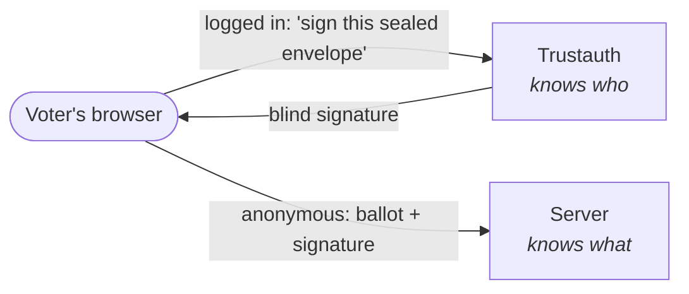
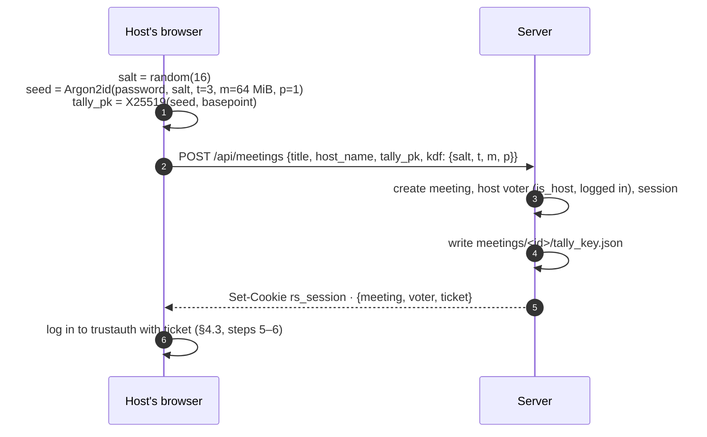
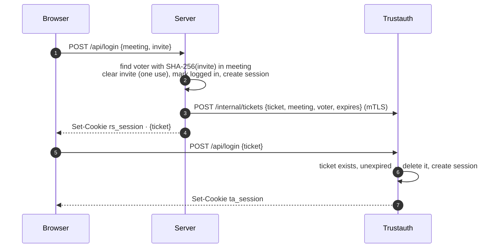
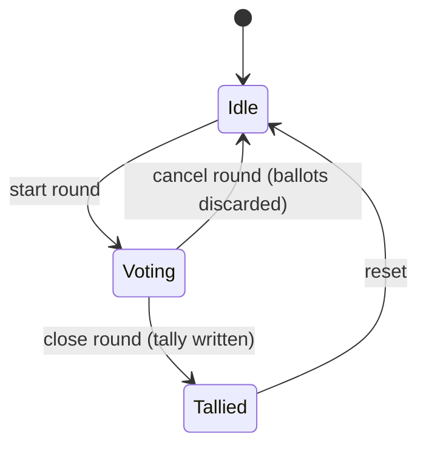
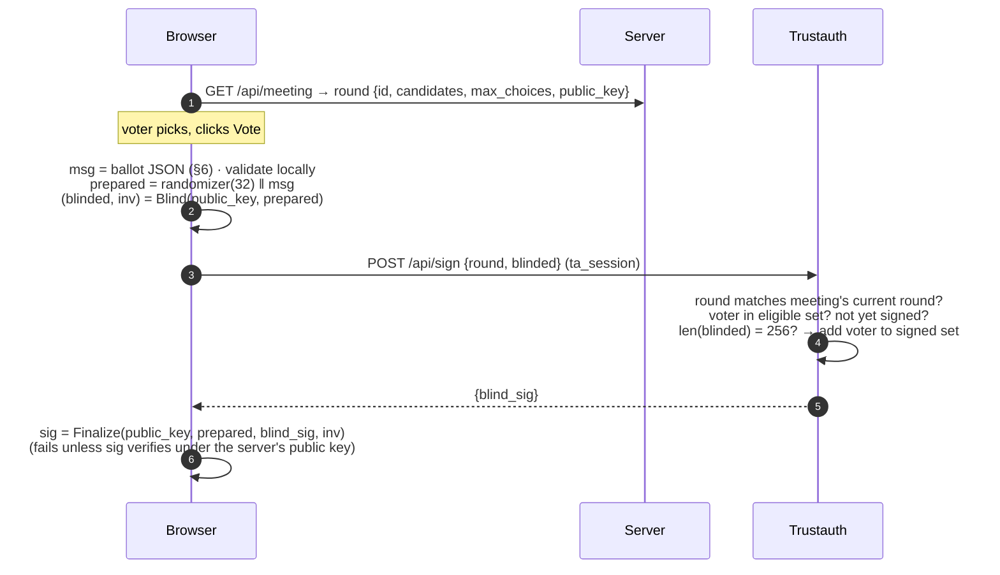

# Rustsystem Protocol (v2.1)

This document is the specification for how Rustsystem authenticates people, collects
anonymous ballots, and stores results. The code implements this document, not the other
way around: if they disagree, one of them is a bug.

It is written to be read top to bottom. The first two sections give the whole picture in
plain words; everything after that is detail you can jump to.

## Contents

1. [The idea in one minute](#1-the-idea-in-one-minute)
2. [Who knows what](#2-who-knows-what)
3. [Identifiers and secrets](#3-identifiers-and-secrets)
4. [Meeting lifecycle](#4-meeting-lifecycle): creating a meeting, inviting, logging in,
   [agenda and attendance](#45-agenda-and-attendance)
5. [Voting round](#5-voting-round): starting, signing, submitting, closing
6. [Ballot format and validation](#6-ballot-format-and-validation)
7. [Refreshing, closing the browser, and lost votes](#7-refreshing-closing-the-browser-and-lost-votes)
8. [Tally files](#8-tally-files)
9. [Guarantees and known limits](#9-guarantees-and-known-limits)
10. [Cryptographic choices](#10-cryptographic-choices)
11. [Alternatives we rejected](#11-alternatives-we-rejected)

---

## 1. The idea in one minute

Rustsystem runs as two services:

- **Trustauth** knows _who_ you are. Once per voting round it will put its signature on
  one ballot for you, but it signs the ballot _blind_, inside a sealed envelope, so it never
  sees what you voted.
- **The server** knows _what_ was voted. It accepts any ballot that carries a valid trustauth
  signature, but ballots arrive without any login, so it never learns whose ballot it is.

A ballot is valid **if and only if trustauth signed it**, and trustauth signs **at most one
ballot per voter per round**. That's the whole voting protocol. The blind signature scheme
(RSA blind signatures, [RFC 9474](https://www.rfc-editor.org/rfc/rfc9474)) guarantees that
trustauth cannot recognise the signature it produced when it later shows up on a ballot.



Nothing secret is ever stored in the browser. Login lives in `HttpOnly` cookies, and the
ballot only exists in memory for the second it takes to sign and submit it. See
[§7](#7-refreshing-closing-the-browser-and-lost-votes) for why this survives refreshes.

## 2. Who knows what

|                                          | Trustauth                         | Server     | Browser                      |
| ---------------------------------------- | --------------------------------- | ---------- | ---------------------------- |
| Voter identity (name, voter ID)          | ✅ (IDs only)                     | ✅         | own only                     |
| Which voters have been signed this round | ✅                                | count only | own only                     |
| Blinded message / blind signature        | sees in transit, **never stores** | ❌         | ✅ (memory)                  |
| Ballot contents and final signature      | ❌                                | ✅         | ✅ (memory)                  |
| Round signing key (private)              | ✅                                | ❌         | ❌                           |
| Round public key                         | ✅                                | ✅         | ✅ (fetched from **server**) |
| Tally password / tally private key       | ❌                                | ❌         | host only, never stored      |

**Trust model.** Anonymity holds as long as trustauth and the server do not pool what they
know (see [§9](#9-guarantees-and-known-limits) for exactly what pooling would reveal). Hosts
run the meeting (they manage the voter list and open and close rounds), but they cannot see
how anyone voted, and they cannot read tally files without the meeting password.

## 3. Identifiers and secrets

All random values come from the OS CSPRNG. Binary values in JSON are base64url without
padding.

| Name              | Format                                            | Lifetime            | Stored where                                           | Purpose                                                                        |
| ----------------- | ------------------------------------------------- | ------------------- | ------------------------------------------------------ | ------------------------------------------------------------------------------ |
| Meeting ID        | UUID v4                                           | meeting             | server, trustauth                                      | Names a meeting. Not secret.                                                   |
| Voter ID          | UUID v4                                           | meeting             | server, trustauth                                      | Names a voter. **Never changes**, even when their invite is reset. Not secret. |
| Invite secret     | 32 random bytes                                   | until used or reset | server stores **SHA-256 only**                         | One-time login link. Possession = right to claim that voter slot.              |
| Server session    | 32 random bytes, cookie `rs_session`              | 12 h                | server stores SHA-256 → (meeting, voter)               | Authenticates the browser to the server.                                       |
| Trustauth ticket  | 32 random bytes                                   | 60 s, single use    | trustauth                                              | Lets the browser log in to trustauth right after logging in to the server.     |
| Trustauth session | 32 random bytes, cookie `ta_session`              | 12 h                | trustauth stores SHA-256 → (meeting, voter)            | Authenticates the browser to trustauth.                                        |
| Round ID          | UUID v4                                           | round               | server, trustauth                                      | Binds ballots to one round. Not secret.                                        |
| Round key pair    | RSA-2048, RSABSSA-SHA384-PSS-Randomized           | round               | private: trustauth; public: everyone                   | Signs ballots. Regenerated every round.                                        |
| Ballot nonce      | 32 random bytes                                   | n/a                 | inside the ballot                                      | Makes every ballot unique.                                                     |
| Tally key         | X25519 key pair derived from the meeting password | meeting             | public key + KDF params on server; private key nowhere | Encrypts tally files at rest.                                                  |

**Cookies** on both services are `HttpOnly; SameSite=Strict; Path=/; Max-Age=43200`, plus
`Secure` in production. They survive page refreshes and browser restarts. Trustauth must be
served from the same registrable domain as the server (e.g. both under
`fsek.studentorg.lu.se`), otherwise Safari treats its cookie as third-party and drops it.

## 4. Meeting lifecycle

### 4.1 Creating a meeting



The password and `seed` never leave the browser. The server only ever holds `tally_pk`, so
it can encrypt tally files but never decrypt them ([§8](#8-tally-files)).

### 4.2 Inviting a voter

A host calls `POST /api/host/voters {name, is_host}`. The server creates the voter with a
fresh voter ID and invite secret, stores `SHA-256(invite)`, and returns the link (and a QR
code of it):

```
https://<server>/login?meeting=<meeting id>&invite=<invite secret>
```

The link contains nothing about host status; that lives only on the voter record. Hosts
learn that the voter has logged in through the meeting event stream ([§5.6](#56-live-updates)).

**Resetting an invite** (`POST /api/host/voters/{id}/reset-invite`) replaces the invite
secret, deletes that voter's sessions on both services (`DELETE /internal/voters/{meeting}/{voter}`
on trustauth), and keeps the **same voter ID**. Removing a voter ends their sessions the same way. Since
trustauth tracks signing by voter ID, a reset can never be used to get a second signature.

The voter list is **frozen while a round is open**: adding, removing and resetting voters
are rejected with `RoundInProgress`.

### 4.3 Logging in



- If step 3 fails (trustauth unreachable), the server rolls back: the invite stays valid and
  no session is created, so the voter can simply retry the link.
- If step 5 fails (e.g. the browser died in between), the browser asks the server for a new
  ticket with `POST /api/trustauth-ticket` (requires `rs_session`).
- All service-to-service traffic goes **server → trustauth** over mTLS. Trustauth never calls
  the server.

### 4.4 Closing a meeting

`DELETE /api/host/meeting` removes the meeting and all its sessions on the server and tells
trustauth to drop its sessions and round (`DELETE /internal/meetings/{id}`). Meetings older
than 12 hours are pruned the same way. Tally files stay on disk (they're encrypted).

### 4.5 Agenda and attendance

Hosts can give a meeting an agenda and record who is present. Neither touches voting: they
run entirely on the server, never involve trustauth, and say nothing about ballots.

**The agenda** is Markdown that a host uploads or writes (`PUT /api/host/agenda`
`{"markdown": "..."}`; at most 64 KiB like every request body). Every heading, `#` to
`######` or setext, is an agenda point; its level is the number of `#`s, and the Markdown up
to the next heading is its body. Text before the first heading is ignored, and so are `#`
lines inside code blocks. An agenda needs 1–200 points, and every title must be a valid
label (at most 120 characters, no control characters). A rejected agenda changes nothing.

```markdown
# Opening

Welcome, and election of a secretary.

# Election of chair

## Nominations

- Alice
- Bob

## Vote

# Closing
```

This is five points: _Opening_, _Election of chair_, _Nominations_, _Vote_, _Closing_.

Every member sees the same agenda in `GET /api/meeting` (`agenda: {points: [{level, title,
body}], current}`, or `null`). Browsers show bodies as plain text, never as HTML.

- **Moving**: `PUT /api/host/agenda/current` `{"index": n}` makes point `n` (0-based) the
  current one, forward or back. The index is absolute rather than "next", so two hosts
  clicking at the same moment can't skip a point. It fails with `NoAgenda` without an agenda
  and `InvalidInput` for an index that doesn't exist.
- **Editing**: uploading again replaces the agenda. The meeting stays on the same point if
  a point with that title still exists (the first at or after the old position, else the
  nearest before it); otherwise it keeps the same position, clamped to the new length.
- **Removing**: `DELETE /api/host/agenda`. `GET /api/host/agenda` returns the Markdown for
  editing.

None of this is blocked while a round is open.

**Attendance.** `POST /api/host/attendance` records everyone **logged in** at that moment:
they have used their invite, and have not been removed or had their invite reset since. It
does not matter whether their page is open. This is the same set that would be eligible if
a round started. Each record is

```json
{
  "takenAt": "2026-10-07T18:02:11.200+00:00",
  "point": { "index": 1, "title": "Election of chair" },
  "present": [{ "id": "…", "name": "Alice", "isHost": true }]
}
```

`point` is a copy of the current agenda point (`null` without an agenda), so later edits to
the agenda never rewrite a record. `GET /api/host/attendance` returns every record, oldest
first, as `{meeting, exportedAt, records}`; hosts download it as `attendance.json`. Like all
meeting state, attendance lives only in memory and is gone when the meeting closes, so
download it first.

## 5. Voting round

A meeting is always in exactly one phase:



### 5.1 Starting a round

`POST /api/host/round {name, candidates, max_choices, shuffle}`:

1. Validate: 1 ≤ candidates ≤ 100, names non-blank, unique and at most 80 characters,
   round name at most 120, 1 ≤ `max_choices` ≤ number of candidates. Shuffle if asked.
2. The voters who have logged in are the **eligible** set.
3. `POST /internal/rounds {meeting, round, eligible: [voter ids]}` → trustauth generates a
   fresh key pair (replacing any previous round for this meeting) and returns the public key
   (SPKI DER).
4. Remove voters who never claimed their invite, and enter `Voting` with
   `{round id, name, candidates, max_choices, public key, eligible count}`.

The meeting stays locked throughout. If step 3 fails, nothing changes (not even the unclaimed
invites are removed) and the host gets an error.

### 5.2 Getting a signature



Trustauth records **only the voter ID** in the round's signed set. It does not store or log
`blinded` or `blind_sig`, and its "signature issued" log line names only the meeting.

Because the browser takes the public key from the **server**, and `Finalize` verifies the
result against it, trustauth cannot use a special key for one voter to recognise their
ballot later (a "key tagging" attack).

### 5.3 Submitting the ballot

```
POST /api/ballot        (sent with credentials: "omit", so no cookies)
{ "meeting": "<id>", "prepared": "<b64url>", "sig": "<b64url>" }
```

The server processes it in this order, rejecting at the first failure:

| #   | Check                                                                                                                               | Error                              |
| --- | ----------------------------------------------------------------------------------------------------------------------------------- | ---------------------------------- |
| 1   | Meeting exists and is in `Voting`                                                                                                   | `MeetingNotFound` / `VotingClosed` |
| 2   | 32 < `len(prepared)` ≤ 1024 and `len(sig)` = 256                                                                                    | `MalformedBallot`                  |
| 3   | `sig` verifies for `prepared` under the round public key                                                                            | `InvalidSignature`                 |
| 4   | `msg` (= `prepared[32..]`) parses and passes every rule in [§6](#6-ballot-format-and-validation), including `round` = current round | `InvalidBallot`                    |
| 5   | `SHA-256(prepared)` not already received                                                                                            | `AlreadyReceived`                  |
| 6   | received count < eligible count                                                                                                     | `BallotLimitReached`               |
| 7   | Record hash, count the choice, notify watchers                                                                                      | none                               |

`AlreadyReceived` means _this exact ballot_ is already counted, so the browser treats it as
success. That makes submission safe to retry.

The ballot handler has no session extractor at all: even if a browser sent a cookie, the
server would not read it. Nothing on this path logs anything that identifies a voter.

### 5.4 Closing a round

`POST /api/host/round/close`:

1. Compute the tally from the counted ballots.
2. Ask trustauth for the signed count (`GET /internal/rounds/{meeting}`). If trustauth is
   unreachable, record it as unknown rather than failing.
3. Encrypt and write the tally file **atomically** (write to a temp file, then rename);
   see [§8](#8-tally-files).
4. Only if step 3 succeeded: enter `Tallied` and tell trustauth to drop the round
   (`DELETE /internal/rounds/{meeting}`, best effort).

If writing the file fails, the request fails and the round **stays open**, so no votes are
lost and the host can retry.

### 5.5 Cancelling or resetting

`DELETE /api/host/round` goes back to `Idle` from `Voting` (ballots are discarded, no file
is written) or from `Tallied`. Trustauth drops the round.

### 5.6 Live updates

`GET /api/meeting/events` is a Server-Sent Events stream of three change counters,
`{"version": 12, "round": 3, "agenda": 5}`, sent on connect and on every change:

- `round` goes up when a round opens, closes or is reset, or the meeting closes.
- `agenda` goes up when the agenda is set, edited or removed, or its current point changes
  ([§4.5](#45-agenda-and-attendance)).
- Together these cover everything a voter's page shows: voter pages refetch
  `GET /api/meeting` only when one of them changes.
- `version` goes up on every change, including each counted ballot and each login. Host pages
  refetch (at most twice a second) when it changes.

Because events carry no state, a dropped and reconnected stream can never leave a page
showing stale data. And because voter pages ignore per-ballot ticks, a round with hundreds of
voters doesn't make every page refetch on every ballot.

## 6. Ballot format and validation

The ballot is a small JSON object. Its exact bytes are what gets signed:

```json
{ "v": 1, "round": "3f2c…", "choice": [0, 2], "nonce": "q8Lw…" }
```

| Field         | Rule                                                                                                                                                                               |
| ------------- | ---------------------------------------------------------------------------------------------------------------------------------------------------------------------------------- |
| `v`           | Must be `1`.                                                                                                                                                                       |
| `round`       | Must equal the current round ID.                                                                                                                                                   |
| `choice`      | `null` for a blank vote, or a list of candidate indices that is **non-empty, strictly ascending** (so no duplicates), every index `< len(candidates)`, at most `max_choices` long. |
| `nonce`       | 32 random bytes, base64url.                                                                                                                                                        |
| anything else | Unknown fields are rejected.                                                                                                                                                       |

The browser applies the **same rules before blinding**. A ballot that trustauth has signed
but the server then rejects would cost the voter their vote, so the client must never sign
one.

The server verifies the signature over the raw bytes first and only then parses them, so
there are no canonicalisation issues: whatever bytes were signed are the bytes that are
checked.

## 7. Refreshing, closing the browser, and lost votes

**Staying logged in.** Both sessions are persistent `HttpOnly` cookies, so refreshing or
reopening the browser keeps the voter logged in for 12 hours. Nothing about login is in
`localStorage`, and page JavaScript can't read the cookies.

**"Did my vote count?"** On every page load the browser asks trustauth
`GET /api/status → {round, signed}`. If `signed` is true for the current round, the page
shows _"Your vote is registered"_ instead of the ballot. This answer comes from the voter's
login, not from anything stored in the browser.

**The one gap.** Between trustauth signing (§5.2) and the server receiving the ballot (§5.3)
there is a window of roughly 100 ms where the signed ballot exists only in the page's memory.
During it the page asks for confirmation before it can be closed. Submission is retried with
backoff for about two minutes, and if it still fails the signed ballot is kept in memory and
the voter can press Submit again; retries are safe ([§5.3](#53-submitting-the-ballot)). If the
page dies inside that window anyway, the vote is lost, and since trustauth already counted
the voter as signed, they can't vote again.

To catch this, the host's view shows three numbers for the round:

| Eligible | Signed (trustauth) | Received (server) |
| -------- | ------------------ | ----------------- |
| 42       | 40                 | 40                |

If **signed > received** when the round closes, a vote was lost in transit and the host can
re-run the round. The same numbers are written into the tally file.

## 8. Tally files

When a round closes, the server writes `meetings/<meeting id>/tally-<timestamp>.enc`. Only
someone with the meeting password can read it.

**Encryption** (ECIES): fresh ephemeral X25519 key → ECDH with `tally_pk` → HKDF-SHA256
(salt = ephemeral public key, info = `rustsystem-tally-v2`) → 32-byte key + 12-byte nonce →
ChaCha20-Poly1305, with the header below as associated data so it cannot be altered.

**Container layout (version 2):**

| Offset | Size | Field                           |
| ------ | ---- | ------------------------------- |
| 0      | 5    | magic `RSTLY`                   |
| 5      | 1    | container version = `2`         |
| 6      | 1    | KDF id = `1` (Argon2id v1.3)    |
| 7      | 16   | KDF salt (the meeting's own)    |
| 23     | 4    | `t_cost`, big-endian u32        |
| 27     | 4    | `m_cost` in KiB, big-endian u32 |
| 31     | 1    | `p_cost`                        |
| 32     | 32   | ephemeral X25519 public key     |
| 64     | 12   | nonce                           |
| 76     | …    | ciphertext + 16-byte tag        |

**Plaintext** (UTF-8 JSON):

```json
{
  "meeting": "Vårmöte 2027",
  "round": "Ordförande",
  "round_id": "3f2c…",
  "closed_at": "2027-03-14T19:02:11Z",
  "candidates": ["Anna", "Bo"],
  "score": [12, 9],
  "blank": 2,
  "counts": { "eligible": 25, "signed": 23, "received": 23 },
  "participants": ["Anna", "Bo", "…"]
}
```

**Decrypting.** Because the KDF parameters are in the header, a file is self-describing:
the password plus the file is enough. The browser (`/admin` tally download) and the offline
CLI (`decrypt-tally <file>`, which prompts for the password) both re-derive the key with
Argon2id and decrypt locally.

## 9. Guarantees and known limits

**Guaranteed**

- **Only eligible voters vote, at most once per round.** A ballot needs a valid signature
  under the round key, only trustauth holds it, and trustauth signs once per eligible voter ID.
  Voter IDs never change, and the voter list is frozen while a round is open.
- **No ballot is counted twice.** The server remembers the hash of every ballot it counts.
- **Ballots can't be altered** after signing: any change breaks the signature.
- **Trustauth can't link a ballot to a voter**, even if it logs everything it sees. The RSA
  blind signature it returns is statistically independent of the final signature on the
  ballot.
- **The server can't link a ballot to a voter.** Ballots arrive without cookies or any other
  identifier.
- **The server can't read stored tallies.** It holds only the public key.

**Known limits**

- **Collusion with network metadata.** If trustauth and the server pooled their logs, they
  could guess links from timing and IP address (a voter is signed at 19:02:11.200, a ballot
  arrives from the same IP at 19:02:11.300). On a shared meeting network many voters share
  an IP, but this is a real limit. The protocol protects against each party on its own, not
  against both acting together.
- **Trustauth could forge ballots** for eligible voters who didn't vote, since it holds the
  round key. The server caps ballots at the eligible count and everyone sees
  eligible / signed / received, which limits and exposes this. The planned v2.3 bulletin
  board makes it independently verifiable.
- **The server could drop ballots.** This shows up as signed > received.
- **Restarts end meetings.** All meeting state is in memory by design; never deploy during
  a meeting.

## 10. Cryptographic choices

| Purpose                         | Choice                                                                                              | Library (Rust / browser)                                                                                                                                                          |
| ------------------------------- | --------------------------------------------------------------------------------------------------- | --------------------------------------------------------------------------------------------------------------------------------------------------------------------------------- |
| Ballot signatures               | RSA blind signatures, RFC 9474 `RSABSSA-SHA384-PSS-Randomized`, 2048-bit, new key per round         | [`blind-rsa-signatures`](https://crates.io/crates/blind-rsa-signatures) 0.18 / [`@cloudflare/blindrsa-ts`](https://www.npmjs.com/package/@cloudflare/blindrsa-ts) 0.4 (WebCrypto) |
| Public key encoding             | SPKI DER, `rsaEncryption` OID (`PublicKey::to_der`), imported in the browser as `RSA-PSS`/`SHA-384` | n/a                                                                                                                                                                               |
| Password → tally key            | Argon2id v1.3, t=3, m=64 MiB, p=1, 16-byte salt per meeting                                         | [`argon2`](https://crates.io/crates/argon2) / [`@noble/hashes`](https://www.npmjs.com/package/@noble/hashes)                                                                      |
| Tally encryption                | X25519 + HKDF-SHA256 + ChaCha20-Poly1305                                                            | `x25519-dalek`, `hkdf`, `chacha20poly1305` / `@noble/curves` + WebCrypto                                                                                                          |
| Session, invite, ticket secrets | 32 random bytes, stored as SHA-256                                                                  | `rand`                                                                                                                                                                            |
| Service-to-service              | mTLS (rustls), server → trustauth only                                                              | `rustls`, `reqwest`                                                                                                                                                               |

No cryptographic primitive is implemented by hand. These choices were checked before
anything was built (the v2.1 phase 0 spike):

- Browser-blinded ballots signed by the Rust signer verify in Rust, and a tampered ballot
  is rejected. Checked in Node, Chromium, Firefox and WebKit (Safari's engine).
- The Rust crate passes the RFC 9474 test vectors. The JS library states compliance with
  the same vectors.
- Argon2id in `@noble/hashes` and the `argon2` crate give byte-identical output. It takes
  ~0.7 s (Chromium), ~1.0 s (Firefox) and ~1.4 s (WebKit) on a laptop at the chosen
  parameters.
- RSA-2048 key generation takes 25–100 ms per round.

## 11. Alternatives we rejected

- **BBS signatures as used in v2.0.** The signature trustauth issued was submitted to the
  server unchanged, so it identified the voter. BBS can be unlinkable, but only by presenting
  a zero-knowledge proof instead of the signature, which needs a much more complex client.
  v2.0's client was also a hand-written port of a Rust library's internals.
- **Storing vote credentials in the browser** (`localStorage`). They would be lost when
  someone clears their browser, and anything stored there can be read by page scripts.
- **Storing vote credentials at trustauth** (what v2.0 did). Trustauth would hold exactly
  the values that link a ballot to a voter.
- **One service instead of two.** Simpler, but then a single operator sees both who and what,
  and the separation is the point of the design.
- **JWTs.** The server looks the voter up on every request anyway; random session tokens in
  a map are simpler and can be revoked instantly.
